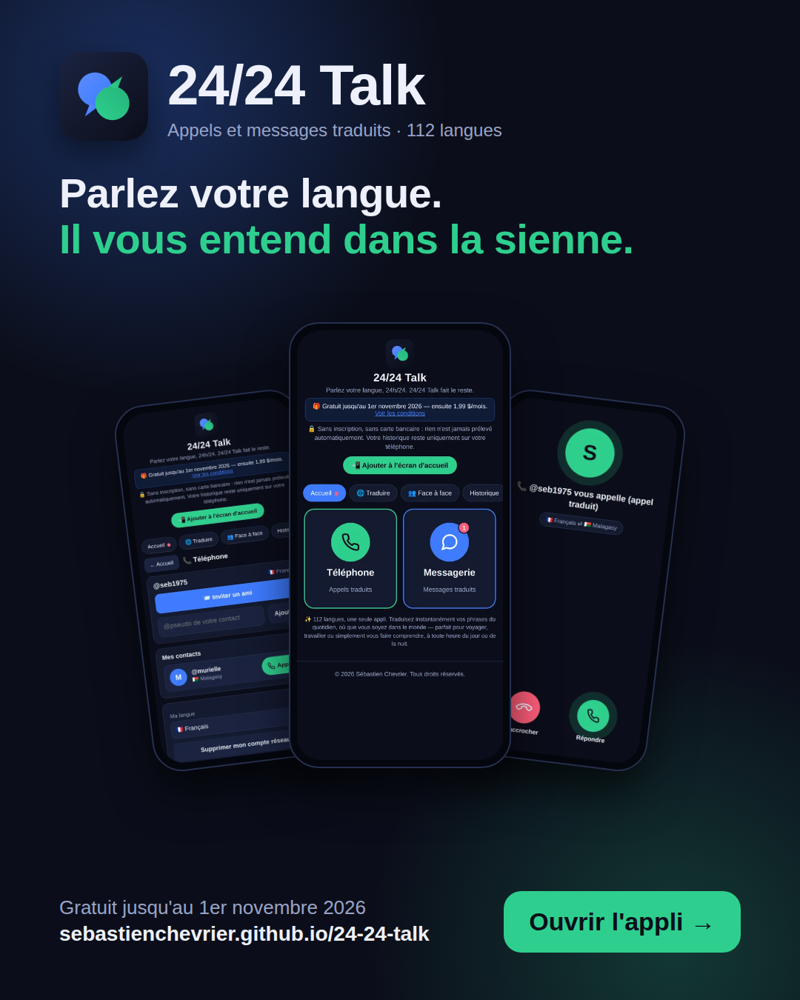

# 24/24 Talk

**Parlez votre langue. Il vous entend dans la sienne.**

Le réseau indépendant d'appels et de messages traduits en direct, dans 112 langues dont le malgache.
Créé à La Réunion par Sébastien Chevrier.

  

  <a href="https://sebastienchevrier.github.io/24-24-talk/"><b>👉 Ouvrir l'appli</b></a>
  &nbsp;·&nbsp;
  <a href="https://sebastienchevrier.github.io/24-24-talk/presentation.html">Voir la présentation</a>

---

## Ce que fait 24/24 Talk

- 📞 **Téléphone** — appelez vos proches : vous parlez votre langue, ils vous entendent dans la leur, en direct.
- 💬 **Messagerie** — écrivez ou dictez : chacun lit le message dans sa propre langue.
- 🛡️ **Réseau indépendant** — un réseau à part entière : appels, messages et traduction, tout se passe dans l'appli. Un pseudo suffit.
- 🌍 **112 langues** — dont le malgache et le swahili. Interface disponible en 11 langues, dont le malgache.

## Pour commencer

1. Ouvrez **https://sebastienchevrier.github.io/24-24-talk/** dans Chrome (ou Safari sur iPhone).
2. Touchez **Téléphone** ou **Messagerie**, puis choisissez un pseudo et votre langue.
3. Touchez **Inviter un ami** et envoyez-lui le lien.

Astuce : sur l'écran d'accueil, le bouton **Ajouter à l'écran d'accueil** installe l'appli comme une vraie application, sans passer par un magasin d'applications.

## Vie privée

- Aucune donnée personnelle demandée : un pseudo suffit.
- Les messages du réseau sont hébergés en France.
- L'historique des traductions reste uniquement sur votre téléphone.

## Tarif

Gratuit jusqu'au 1er novembre 2026, sans inscription et sans carte bancaire. Ensuite : 1,99 $ par mois.

---

© 2026 Sébastien Chevrier — La Réunion. Tous droits réservés.
Le code de cette application est visible publiquement, mais il n'est pas libre de droits : toute reproduction, modification ou réutilisation sans autorisation écrite de l'auteur est interdite.
